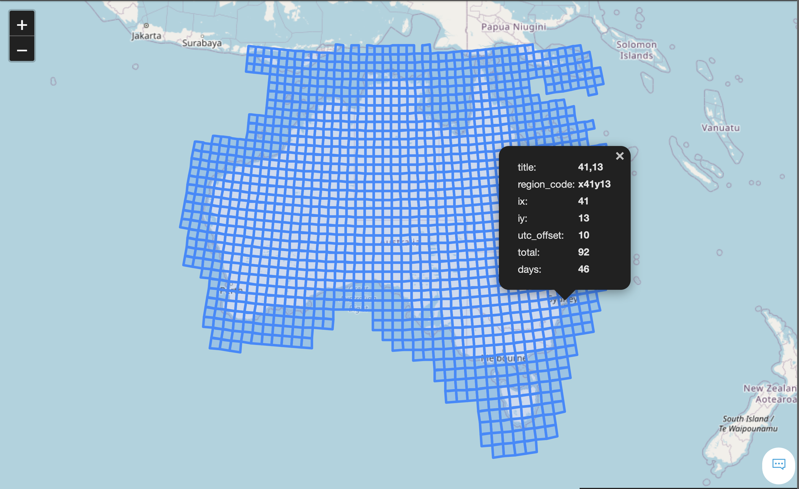
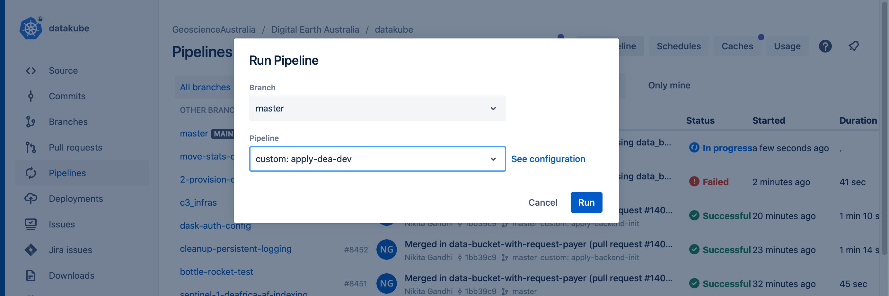
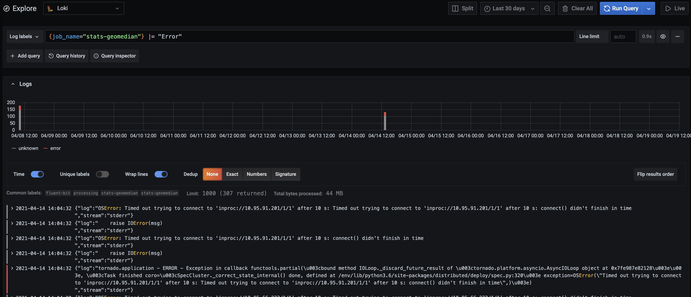

# ODC Statistician

Statistician is a framework of tools for generating statistical summaries of
large collections of Earth Observation Imagery managed in an Open
Datacube Instance. It is a spiritual successor to [datacube-stats](https://github.com/opendatacube/datacube-stats/),
but intended to run in a cloud environment rather than on a HPC.

It has already run at continental scale to produce annual geomedian summaries of all of Africa based on Sentinel-2 data.

It is still under development, including adding support for processing sibling products, eg. Water Observations together with Surface Reflectance Quality classifications.


## Installation

```
pip install odc-stats
```

## Usage

Statistician offers a set of tools to generate clear pixel count and geometric median on Sentinel-2 and Landsat satellite images.
Running statistician requires a few steps, to prepare and cache the input data, set up the configuration file


### Steps to run statistician

### 1 - Save tasks

From your Sandbox (or a machine that has access to your ODC database), run:

```
odc-stats save-tasks --frequency annual --grid au-30  ga_ls8c_ard_3
```

Running this command generates a set of files:

1. a CSV file listing all tasks for all the years in the database
2. a dataset cache file used by statistician when running jobs
3. A GeoJSON file per year, for visualising the prospective run

```
ga_ls8c_ard_3_all-2013--P1Y.geojson
ga_ls8c_ard_3_all-2014--P1Y.geojson
ga_ls8c_ard_3_all-2015--P1Y.geojson
ga_ls8c_ard_3_all-2016--P1Y.geojson
ga_ls8c_ard_3_all-2017--P1Y.geojson
ga_ls8c_ard_3_all-2018--P1Y.geojson
ga_ls8c_ard_3_all-2019--P1Y.geojson
ga_ls8c_ard_3_all-2020--P1Y.geojson
ga_ls8c_ard_3_all-2021--P1Y.geojson
ga_ls8c_ard_3_all.csv
ga_ls8c_ard_3_all.db
```

The CSV file contains the list of tasks for all the years and consists of x, y coordinates of each destination tile, as well as the counts of datasets and satellite observations.

GeoJSON files are useful when selecting test regions as well as for debugging specific tasks - see the example below from Landsat-8, 2015.  This example shows a tile from an Australian coastal region near Sydney.



#### Dataset Fusing

Some summary products require data from bands stored in multiple products. Products can be fused to use bands from both products in the derivitive products, this creates a virtual product that contains the bands from both products. Note that for datasets to be fused they must have the same `center_time` and `region_code`. This process find the matching dataset from each product that are in the same time and place and fuses them into one product.

An example of this is `fc-percentiles`, which uses the fractional covers bands in `ga_ls_fc_3` to calculate the percentiles, and uses the `ga_ls_wo_3` band to mask out bad data.  

Two products can be fused using the following syntax:

```
odc-stats save-tasks --frequency annual --grid au-30 --year 2017 ga_ls_fc_3+ga_ls_wo_3
```


#### Caching datasets from multiple products

Some summary products require data from multiple satellites, e.g. `tcw_pc` uses scenes from `ga_ls5t_ard_3`, `ga_ls7e_ard_3`, and `ga_ls8c_ard_3`. Note that this is different from fusing products, the scenes do not have to be in the same place or time and this simply caches the datasets from each product as is. To save datasets from multiple products:

```
odc-stats save-tasks --frequency annual --grid au-30 --year 2017 ga_ls5t_ard_3-ga_ls7e_ard_3-ga_ls8c_ard_3
```

### 2 - Run Statistician

To actually run Statistician to produce some output data, it requires:

1. A **task cache/database**, as generated in the previous step.
2. A **YAML configuration file** describing the calculations to perform, 
   where to output data, what metadata to attach, etc. 
   
Statistician has multiple different execution modes:

1. Execute a single task. Useful when testing.
2. Execute a set of tasks from the task database.
3. Pull tasks continuously from an SQS queue and exit when the queue is empty.
   See [Orchestration](#orchestration) below for running large jobs.

A sample command to run a single task:

```
odc-stats run ga_ls8c_ard_3_all.db \
 2015--P1Y/41/13 \
 --config cfg.yaml \
 --resolution=30 \
 --location file:///localpath/ \
 --threads=16 \
 --memory-limit=60Gi
```

```
Usage: odc-stats run [OPTIONS] FILEDB [TASKS]...

  Run Stats.

  Task could be one of the 3 things

  1. Comma-separated triplet: period,x,y or 'x[+-]<int>/y[+-]<int>/period
     2019--P1Y,+003,-004
     2019--P1Y/3/-4          `/` is also accepted
     x+003/y-004/2019--P1Y   is accepted as well
  2. A zero based index
  3. A slice following python convention <start>:<stop>[:<step]
      ::10 -- every tenth task: 0,10,20,..
     1::10 -- every tenth but skip first one 1, 11, 21 ..
      :100 -- first 100 tasks

  If no tasks are supplied and --from-sqs is not used, the whole file will
  be processed.
```

Where `cfg.yaml` contains the following configuration (a sample from a geomedian run):
```yaml
plugin: gm-ls
plugin_config:
  resampling: bilinear
  bands: ["blue", "red", "green", "nir", "swir1", "swir2"]
  rgb_bands: ["red", "green", "blue"]
  mask_band: fmask
  cloud_classes: ["shadow", "cloud"]
  filters: [0, 0] 
  aux_names:
    smad: sdev
    emad: edev
    bcmad: bcdev
    count: count
product:
  name: ga_ls8c_nbart_gm_cyear_3
  short_name: ga_ls8c_nbart_gm_cyear_3 
  version: 3.0.0
  product_family: geomedian
max_processing_time: 3600
job_queue_max_lease: 300
renew_safety_margin: 60
future_poll_interval: 2
s3_acl: public-read
# Generic product attributes
cog_opts:
  zlevel: 9
  overrides:
    # If you're making an RGBA image, compress better
    rgba:
      compress: JPEG
      jpeg_quality: 90
    # If you're writing a categorical raster, do overview resampling with nearest or mode
    qa:
      overview_resampling: nearest
```

Note that configurations will vary between different products. See this [sample configuration for Australian Landsat-8](https://bitbucket.org/geoscienceaustralia/datakube-apps/src/develop/workspaces/dea-dev/processing/06_stats.yaml).

If no cog_opts:overrides:rgba in configurations or relative plug-in rgba method return None. There is no rgba.tif in output files.

It is also possible to define custom plugins outside of `odc.stats.*`. To do that, define class deriving from `odc.stats.model.StatsPluginInterface` and implement `.input_data` and `.reduce` methods. You can then specify fully qualified name of your custom plugin in `cfg.yaml`.

```yaml
plugin: mycustomlib.SomePluginOfMine
plugin_config:
   param1: 100
   param2: "string param"
   # ...
```

## Orchestration

> :warning: **This documentation section references some private configuration**
>
> Also, Statistician Orchestration is still under development. As it stabilising look here
> for more information.

To run Statistician on a large volume of data, use the Statistician orchestration tool which relies on SQS queues and Kubernetes jobs.
Before running a job, you will need to create the necessary infrastructures by running the step 1 described below.

### 1. Create queues and a user 
Each user will need to create a user and a queue to publish their tasks to.
Note that each queue will have a corresponding dead letter queue. 

The user and the queue will be created using a Terraform module which contains code similar to the following:

```terraform
module "odc_stats_geomedian" {

  source = "../../../modules/statistician"

  stats_process = "geomedian"

  destination_bucket = "destination-bucket-name"
  destination_path   = "gm_s2_annual"

  test_bucket = "test-bucket-name"

  cluster_id = local.cluster_id
  owner      = local.owner
}
```
The statistician process name is used to name the user and the queue, and the destination and test buckets specifies the output locations in which this user has access to.

For an example, check the following file:
```
https://bitbucket.org/geoscienceaustralia/datakube/src/master/workspaces/deafrica-dev/03_odc_k8s_apps/stats_procesing.tf
```
Once you created a file similar to the above file, run the datakube pipeline:




### 2. Publish tasks 

```
odc-stats publish-tasks s3-bucket/s3-prefix/ga_ls8c_nbart_gm_cyear_3.db  stats-queue [task-id/index] --dry-run
```
This function populates  ```stats-queue``` from the cache file. Each message contains a tile id or an index. An example of a tile id is shown below:

```x+003/y+004/2019--P1Y```

```publish-tasks``` publishes all the messages in the cache file by default.
However, the command offers an option to publish a subset of tasks based on their indexes from the CSV file.
For example, if your CSV file contains tasks across multiple years, you can just publish tasks belonging to a particular year by providing the range:

```
tasks=$(shuf -i  1000-2000)
```

Where 1000 to 2000 covers the indexes for a single year.
Always run with the dryrun option and check tasks against the CSV file to ensure you're publishing the correct set of indexes.

### 3. Run tasks 

To run a job, create a job template.
The job template is a YAML file which uses the AWS user and the queue that you created in step 1 and specifies your run configurations.
This includes, location of the cache file containing the status of the dataset, the queue containing the list of tasks to process, AWS node group types to be deployed, resource requests and limits, plugin and product configs.
An example of the job definition for running geometric median on Landsat-8 can be found in the following location.


<span style="color:red">WARNING:  Do not run the following configurations directly as it will overwrite existing data.  Always change the output directory, user and the queue to point to the infrastructure which you created in step 1.</span>
```
https://bitbucket.org/geoscienceaustralia/datakube-apps/src/develop/workspaces/dea-dev/processing/06_stats.yaml
```

The following command will start your job.  This will create n pods where n is the number of replicas specified in your template.
```
kp apply -f path-to-job-template
```

When you run statistician using jobs, tasks that are tried three times and have failed, will end up in the dead letter queue.
The user can then find the logs corresponding to these tasks and identify why they failed.
If the failure is due to resource limits, a rerun will usually pass.
However, if failure is due to issues such as bad datasets, you need to archive the bad datasets and regenerate your cache file before restarting the job.

### Issues 

During the run, monitor the number of inflight messages.
This can be done from the cli or the dashboard.
Counts of inflight messages should be the same as (or close to) the number of pod/replicas.

Currently when the jobs complete, pods do not shutdown cleanly due to an error in the dask library.
In order to ensure assigned EC2 instances are released, you need to delete the job manually by running the following command:

``` 
kubectl pod delete -f path-to-job-template.yaml
```

Monitor the AWS Autoscaling Groups and ensure they are reduced to 0 once the job has completed.
There is a delay of about 10 minutes before ASGs are released. 

### 4. Redrive queue
For tasks that have failed and need to be retried, they can be redirected to the main statistician queue using the following command:

```
redrive-queue stats-dead-letter-queue-name  dead-letter-queue-name 
```

### Monitoring

Grafana is a powerful tool for monitoring statistician jobs and pods.
You can query all the logs for a single job, to detect errors, or drill down into logs of a particular pod to identify specific issues for tasks.
To use this, log into the grafana which corresponds to the cluster that you're running the job in, from the left panel, select ```Explore```, change the explore method to ```Loki```, from log label, select ```job_name``` and then select your job name for example, ```stats-geomedian```.
You can now run a query on the log of the selected job:



## Mosaics

To quickly review products, stats can generate a low resolution continental mosaic of a summary product. To run the command:

```
odc-stats generate-mosaic product_definition.yaml 's3://input-data-bucket/folder/*/*/metadata-file.stac-item.json' s3://output-bucket/folder/subfolder --bands nbart_red,nbart_blue
```

The arguments are:

- an ODC product definition `yaml` file defining the input summary product
- an `s3://` glob that specifies the location of the `metadata` for the datasets to be included
- the destination bucket and folder
- and the bands to be included in the mosaic. If no bands are specified all bands are used


This generates a COG per band with 7 overview layers into the destination `s3://` location.

This is fully parallelised, run time should scale almost linearly with number of
CPU cores. Memory usage should be something like `2048 * 2048 * bands *
dtype_size * num_cores`, so for 64 cores maybe something like ~1GB ish. Each
core gets a 2048 * 2048 chunk of the whole continent.
