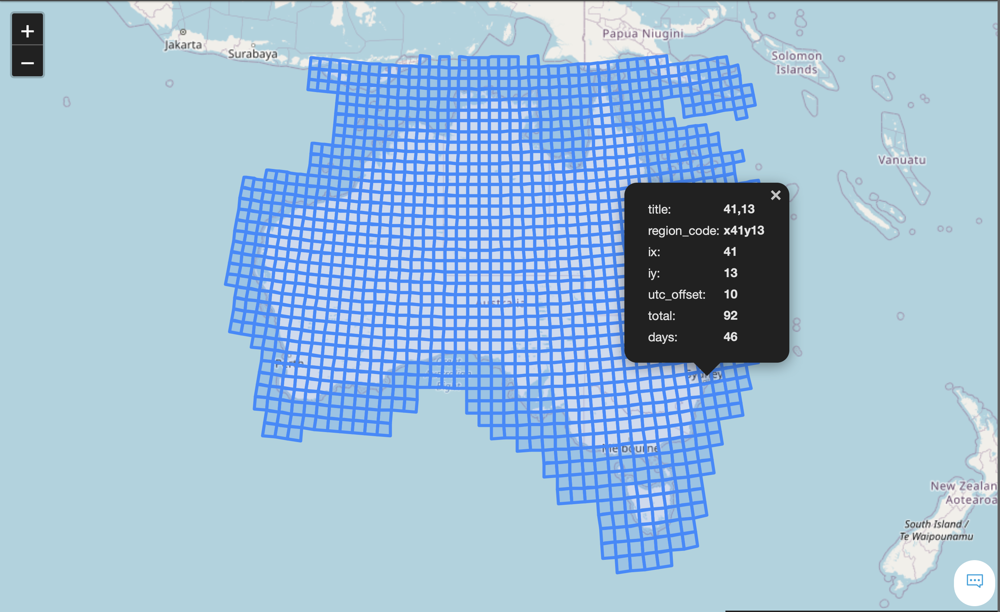

odc.stats
=========

Statistical product generation framework.

Installation
------------

```
pip install --extra-index-url="https://packages.dea.ga.gov.au" odc-stats
```

Usage
-----
Stats offers a set of tools to generate clear pixel count and geometric median on Sentinel-2 and Landsat satellite images and it's currently being extended to support sibling products.

### Steps to run stats

### 1- Save tasks

From your sandbox (or a machine that has access to your database), run:

```
odc-stats save-tasks --frequency annual --grid au-30  ga_ls8c_ard_3
```

The above command will generate the following files i.e. a csv file containing a list of tasks for all the years in the dataset, a cache file that will be used as an input to the stats cli, and several geojson files (one for each year).  

```
ga_ls8c_ard_3_all-2013--P1Y.geojson
ga_ls8c_ard_3_all-2014--P1Y.geojson
ga_ls8c_ard_3_all-2015--P1Y.geojson
ga_ls8c_ard_3_all-2016--P1Y.geojson
ga_ls8c_ard_3_all-2017--P1Y.geojson
ga_ls8c_ard_3_all-2018--P1Y.geojson
ga_ls8c_ard_3_all-2019--P1Y.geojson
ga_ls8c_ard_3_all-2020--P1Y.geojson
ga_ls8c_ard_3_all-2021--P1Y.geojson
ga_ls8c_ard_3_all.csv
ga_ls8c_ard_3_all.db
```

The csv file contains the list of tasks for all the years and consists of x, y coordinates of each tile to be processed as well as the counts of datasets and satellite observations.

geojson files are useful when selecting test regions as well as for debugging specific tasks - see the example below from Landsat-8, 2015.  This example shows a tile from Australia coastal region near Sydney.




### 2- Run stats
Sample command:
```
odc-stats run ga_ls8c_ard_3_all.db  2015--P1Y/41/13 --threads=16 --memory-limit=60Gi --resolution=30 --config cfg.yaml --location file:///localpath/
```  

Where cfg.yaml contains the following configurations (sample from a geomedian run):
```
plugin: gm-ls
plugin_config:
  resampling: bilinear
  bands: ["blue", "red", "green", "nir", "swir1", "swir2"]
  rgb_bands: ["red", "green", "blue"]
  mask_band: fmask
  cloud_classes: ["shadow", "cloud"]
  filters: [0, 0] 
  aux_names:
    smad: sdev
    emad: edev
    bcmad: bcdev
    count: count                   
product:
  name: ga_ls8c_nbart_gm_cyear_3
  short_name: ga_ls8c_nbart_gm_cyear_3 
  version: 3.0.0
  product_family: geomedian
max_processing_time: 3600
job_queue_max_lease: 300
renew_safety_margin: 60
future_poll_interval: 2
s3_acl: public-read
# Generic product attributes
cog_opts:
  zlevel: 9
  overrides:
    rgba:
      compress: JPEG
      jpeg_quality: 90
```

Note that the configurations vary between different products.  A sample plugin configuration for Australia on Landsat-8 can be found here: 
```
https://bitbucket.org/geoscienceaustralia/datakube-apps/src/develop/workspaces/dea-dev/processing/06_stats.yaml
```

Orchestration
-----

In order to run stats on a large volume of data, use stats orchestration tool which relies on SQS queues and Kubernetes jobs.  Before running a job, one needs to create the necessary infrastructures by running the step 1 described below.

### 1- Create queues and a user 
Each user will need to create a user and a queue to publish their tasks to.  Note that each queue will have a corresponding dead letter queue. 

The user and the queue will be created using a terraform module which contains code similar to the following:

```
module "odc_stats_geomedian" {

  source = "../../../modules/statistician"

  stats_process = "geomedian"

  destination_bucket = "destination-bucket-name"
  destination_path   = "gm_s2_annual"

  test_bucket = "test-bucket-name"

  cluster_id = local.cluster_id
  owner      = local.owner
}
```
The stats process name is used to name the user and the queue, and the destination and test buckets specifies the output locations in which this user has access to.

For an example, check the following file:
```
https://bitbucket.org/geoscienceaustralia/datakube/src/master/workspaces/deafrica-dev/03_odc_k8s_apps/stats_procesing.tf
```
Once you created a file similar to the above file, run the datakube pipeline:


### 2- Publish tasks 

```
odc-stats publish-tasks s3-bucket/s3-prefix/ga_ls8c_nbart_gm_cyear_3.db  stats-queue [task-id/index] --dry-run
```
This function populates  ```stats-queue``` from the cache file. Each message contains a tile id or an index. An example of a tile id is shown below:

```x+003/y+004/2019--P1Y```  

```publish-tasks``` publishes all the messages in the cache file by default.  However, the command offers an option to publish a subset of tasks based on their indexes from the csv file.  For example, if your csv file contains tasks across multiple years, you can just publish tasks belonging to a particular year by providing the range:

```
tasks=$(shuf -i  1000-2000)
```

Where 1000 to 2000 covers the indexes for a single year.
Always run with the dryrun option and check tasks against the csv file to ensure you're publishing the correct set of indexes.

### 3- Run tasks 

In order to run a job, create a job template.  The job template is a yaml file which uses the AWS user and the queue that you created in step 1 and specifies your run configurations.  This includes, location of the cache file containing the status of the dataset, the queue containing the list of tasks to process, AWS node group types to be deployed, resource requests and limits, plugin and product configs.  An example of the job definition for running geometric median on Landsat-8 can be found in the following location.


<span style="color:red">WARNING:  Do not run the following configurations directly as it will overwrite existing data.  Always change the output directory, user and the queue to point to the infrastructure which you created in step 1.</span>
```
https://bitbucket.org/geoscienceaustralia/datakube-apps/src/develop/workspaces/dea-dev/processing/06_stats.yaml
```

The following command will start your job.  This will create n pods where n is the number of replicas specified in your template.
```
kp apply -f path-to-job-template
```

When you run stats using jobs, tasks that are tried three times and have failed, will end up in the dead letter queue.  The user can then find the logs corresponding to these tasks and identify why they failed.  If the failure is due to resource limits, a rerun will usually pass.  However, if failure is due to issues such as bad datasets, you need to archive the bad datasets and regenerate your cache file before restarting the job.

### Issues 

During the run, monitor the number of inflight messages.  This can be done from the cli or the dashboard.  Counts of inflight messages should be the same as (or close to) the number of pod/replicas.

Currently when the jobs complete, pods do not shutdown cleanly due to an error in the dask library.  In order to ensure assigned EC2 instances are released, you need to delete the job manually by running the following command:

``` 
kp delete -f path-to-job-template.yaml
```

Monitor the AWS Autoscaling Groups and ensure they are reduced to 0 once the job has completed.  There is a delay of about 10 minutes before ASGs are released. 

### 4- Redrive queue
For tasks that have failed and need to be retried, they can be redirected to the main stats queue using the following command:

```
redrive-queue stats-dead-letter-queue-name  dead-letter-queue-name 
```

### Monitoring
Grafana is a powerful tool for monitoring stats jobs and pods.  You can query all the logs for a single job, to detect errors, or drill down into logs of a particular pod to identify specific issues for tasks.  To use this, log into the grafana which corresponds to the cluster that you're running the job in, from the left panel, select ```Explore```, change the explore method to ```Loki```, from log label, select ```job_name``` and then select your job name for example, ```stats-geomedian```.  You can now run a query on the log of the selected job:


